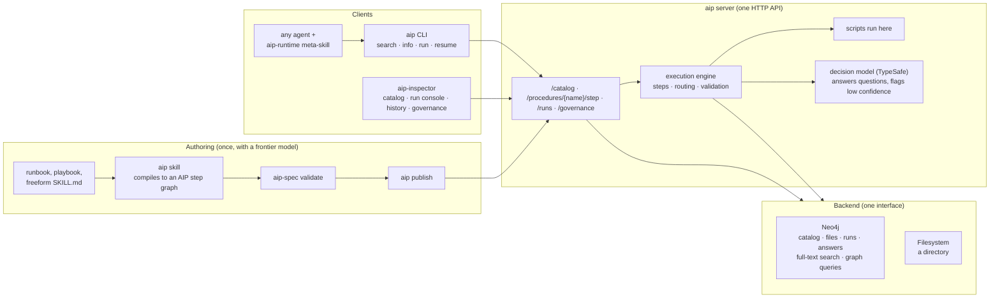

<table>
  <tr>
    <td width="200" align="center" valign="middle">
      
    </td>
    <td valign="middle">
      <h1>AIP — Agent Instruction Protocol</h1>
      <p><em>Structured Skills for Performance & Governance</em></p>
    </td>
  </tr>
</table>

## What Is AIP?

Agent Instruction Protocol (AIP) is a protocol that uses graphs to represent and run procedures.

A **procedure** is an instance of step-by-step know-how: an executable workflow that guides an agent on how to perform a task using tools and logical sequences.

Two protocols cover parts of this today. **MCP** decouples tools, resources, and other assets into a portable service any agent can call. **Agent Skills** represent procedural knowledge in a portable way that humans can read and maintain. AIP replaces both with a single unified protocol, built to give teams running autonomous agents predictability, governance, and cost savings. By treating procedures as first-class citizens, AIP provides a client-server architecture for not just calling individual tools but sequenced workflows of tools and steps, with typed I/O contracts, that can be distributed, executed by economical AI models, and governed by humans on the backend.

Our research shows AIP lifting Claude Sonnet's task pass rate from 51% to 63% over the same skills as Agent Skills ([Evidence So Far](#evidence-so-far)).

## AIP Design

AIP is two pieces:

1. **A spec.** A serialized representation of procedures, for information exchange and for distillation: compiling memory, documents, and other data into procedures. The AIP spec is an extension of the [Agent Skills spec](https://agentskills.io/home) and an AIP skill can be used exactly like an Agent Skill. The freeform markdown body is replaced with a fenced YAML block validated against a [JSON Schema](https://json-schema.org/): typed steps with inputs and edges, decisions with named questions, scripts, tasks for the client, and routers. The spec lives in [zach-blumenfeld/aip-spec](https://github.com/zach-blumenfeld/aip-spec).
2. **A runtime protocol.** A client-server architecture for executing procedures that uses the graph topology to enforce sequencing and typed I/O between steps. The server walks the graph, runs scripts, answers decisions with a structured decision model, and follows routers; the client, an agent or a person, handles only the pauses. Published procedures are content-hashed revisions in a catalog the server searches, and every run is recorded against the revision that ran. The runtime is this repository.

## How It Works



The agent never decides anything the procedure can decide. It starts a run, and the server walks the graph: it validates each step's input, runs scripts, asks the decision model, and follows routers. It stops only at a pause the agent must handle: a task to perform, a decision answered below its threshold to confirm or override, or, with no decision model configured, the questions themselves. Every step, answer, and pause is recorded against the revision that ran, which is what the history and governance views read.

## Evidence So Far

Our paper [AIP: A Graph Representation for Learning and Governing Agent Skills](https://arxiv.org/pdf/2606.04781), published at a VLDB 2026 workshop, measured the previous format (`0.3a3`, skills as structured YAML loaded into context, before the server existed) on a stratified core of 24 [SkillsBench](https://www.skillsbench.ai) tasks. Each task's human-curated skill was converted to AIP once by Claude Opus; Claude Sonnet 4.6 then solved the task with either the original or the conversion, five trials per task.

| Skill given to the solver | Pass rate | Mean reward |
|---|---|---|
| Human-curated Agent Skill | 50.8% | 0.567 |
| The same skill converted to AIP | **63.3%** | **0.668** |

Tool-call counts were about equal, and wall clock was lower on the AIP side in two of the three task cohorts. The format has moved on since (typed step kinds, a decision model with thresholds, server-side scripts, the runtime block); measuring this release the same way is the next study, and the harness is [aip-skillbench](https://github.com/zach-blumenfeld/aip-skillbench).

## Install

One line installs [uv](https://docs.astral.sh/uv/) if missing, the `aip` CLI with [`aip-spec`](https://github.com/zach-blumenfeld/aip-spec) (the format and its validator), and both Agent Skills, `aip` (authoring and validating AIP skills) and `aip-runtime` (running published procedures), into every agent it detects (Claude Code, Cursor, Windsurf, Copilot, Gemini CLI, Cline, Codex, Pi, OpenCode, Junie):

```bash
curl -sSfL https://raw.githubusercontent.com/zach-blumenfeld/aip/main/install.sh | bash    # aip + aip-spec + both skills
```

Only the format, no runtime (author and validate skills, nothing to run them against):

```bash
curl -sSfL https://raw.githubusercontent.com/zach-blumenfeld/aip-spec/main/install.sh | bash   # aip-spec + the aip skill
```

Prefer Python tooling:

```bash
uv tool install git+https://github.com/zach-blumenfeld/aip-spec.git@v0.5a1   # `aip-spec`, the validator the skill calls
uv tool install "aip[server] @ git+https://github.com/zach-blumenfeld/aip.git@aip-0.5a0"   # `aip` with `aip server`; pulls aip-spec in
aip skill install                   # both skills, every detected agent
aip skill install claude-code       # one agent;  aip skill list  shows them
aip skill install --path ./.claude/skills    # a project-local skills directory
aip skill remove
```

Once installed, ask your agent something like *"author an AIP procedure skill for X"* or *"validate this AIP skill folder."* The skill walks the rest of the conversation. With `AIP_SERVER` set, the `aip-runtime` skill has the agent search the catalog and run a matching procedure instead of doing the steps by hand.

The [End-to-End Walkthrough](#end-to-end-walkthrough) below takes a fresh machine through install, a Neo4j-backed server with the inspector, an agent run, and authoring a skill.

### Model Recommendation for Co-Authoring

Use the **largest frontier model available** when using the AIP skill. The work is cognitively intense and underrepresented in current training data — smaller models struggle.

For *consuming* the resulting skill, the opposite holds: AIP's structure is what makes smaller, cheaper models more competitive on workflow-heavy tasks.

## End-to-End Walkthrough

Everything here is on the `aip-0.5a0` branch of [zach-blumenfeld/aip](https://github.com/zach-blumenfeld/aip), not `main`.

### Prerequisites

- macOS or Linux with `curl`.
- A Neo4j database. [Aura](https://console.neo4j.io) works.
- A [TypeSafe](https://typesafe.ai) API key. Optional: without it, every decision step pauses and asks you/agent to answer instead of a decision model.
- [Claude Code](https://claude.com/claude-code) for steps 5 and 6. Any agent `aip skill list` names works the same way.

### 1. Install

```bash
curl -sSfL https://raw.githubusercontent.com/zach-blumenfeld/aip/aip-0.5a0/install.sh | bash
```

That installs [uv](https://docs.astral.sh/uv/) if missing, then two commands, `aip-spec` (the format and validator) and `aip` (runtime, server, client), and puts two Agent Skills into every agent it detects: `aip` for authoring and `aip-runtime` for running published procedures. Check:

```bash
aip --help
aip skill list          # which agents got the skills
```

If `aip` is not found, open a new terminal. uv installs commands into `~/.local/bin`.

### 2. Start a server on Neo4j, with the example published

```bash
aip server --init       # writes ~/.config/aip/server.toml, every setting commented
```

Open that file and set 6 lines. 

Under `[backend]`:
```toml
kind = "neo4j"
uri = "neo4j+s://xxxxxxxx.databases.neo4j.io"   # from Aura
user = "neo4j"
password = "..."
database = "neo4j"
```

Under `[decision_model]`
```toml
api_key = "..." # your TYPESAFE_API_KEY  , optioal but highly recommended 
```
Then start the aip server:

```bash
aip server --inspector
```
Leave it running. In a second terminal you will publish an AIP skill to the server. 
You will use the hello-world example for now.  Later you will see how to compile your own. 

```bash
aip config --server http://localhost:8000      # where the client and the agents send requests
aip-spec example billing-support --out .       # the bundled example skill, written to ./billing-support
aip publish billing-support                    # validates, uploads, prints billing-support@<revision>
```

`aip publish <folder>` is how any skill gets onto the server. `aip list` shows the catalog.

### 3. The inspector

Open http://localhost:8000/inspector/. Four tabs across the top plus the server link at the right:

- **catalog**: every published name with its step graph drawn. Click `billing-support` for the procedure page: purpose, triggers, each step with its inputs and questions, the files it ships (source viewer), the diff between any two revisions, and the governance controls (pin a revision, retire one, override a decision's confidence thresholds).
- **run**: the run console. Pick a procedure, fill the start input, start. The console walks the steps and stops at every pause for you to answer: a decision the model was unsure about, a task it needs the client to do, or the questions themselves when there is no model.
- **history**: every run, step by step, with what each step got and produced.
- **governance**: corpus queries across all runs: decisions the client overrode, scripts that failed, skills missing fields, branches no run has taken.
- **server link** (top right): the server URL and bearer token the page uses.

Try two runs of `billing-support`. Message `I was charged twice this month and I am furious, fix it or I cancel`: the model marks it billing and angry, the router sends it to the escalation script, and the run ends with a ticket id and the tier2 queue. Message `Hi, could you tell me whether my March invoice was a duplicate?`: calm, so the run pauses with a client task asking you to draft the reply from the policy; type one and the run ends.

### 4. See it in Neo4j

Open your database in Neo4j Browser or Query and run these. The skill and its procedure graph:

```cypher
MATCH (n:Name {name: 'billing-support'})-[:HAS_REVISION]->(s:Skill)-[:HAS_PROCEDURE]->(p:Procedure)
MATCH p1 = (p)-[:HAS_STEP]->(st:Step)
OPTIONAL MATCH p2 = (st)-[:INPUTS_TO|BRANCH]->(:Step)
OPTIONAL MATCH p3 = (st)-[:DECLARES_INPUT|ASKS]->()
RETURN n, s, p, p1, p2, p3
```

Every run of the skill, with the answers and the steps they ran against:

```cypher
MATCH (r:Run {name: 'billing-support'})-[:OF_SKILL]->(s:Skill)
MATCH p1 = (r)-[:STEP_RUN]->(sr:StepRun)
OPTIONAL MATCH p2 = (sr)-[:NEXT]->(:StepRun)
OPTIONAL MATCH p3 = (sr)-[:OF_STEP]->(:Step)
OPTIONAL MATCH p4 = (sr)-[:ANSWERED]->(:Answer)-[:OF_QUESTION]->(:Question)
RETURN r, s, p1, p2, p3, p4
```

Just the run trails, when that gets busy:

```cypher
MATCH p = (r:Run {name: 'billing-support'})-[:STEP_RUN]->(:StepRun)-[:NEXT*0..]->(:StepRun)
RETURN p
```

Every file of every revision is also in there as `File` nodes with exact bytes; `aip get billing-support --out ./restored` rebuilds the folder from them and verifies the hashes.

### 5. Run it through an agent

The installer put the `aip-runtime` skill into Claude Code if it found it so you should be able to just ask the below to see it work:

- `A customer wrote: "I was charged twice! Refund me today or I'm gone." Handle it.`
- `A customer asks politely whether they can still get a refund on a subscription they forgot to cancel last month. Deal with it.`

`aip skill list` shows `installed`, and if not, `aip skill install claude-code` does it now. Step 2 pointed the `aip` command at your server with `aip config`. The agent never learns the URL; the skill tells it to run `aip search`, `aip run`, and `aip resume`, and those read the config.

Watch it search the catalog, find `billing-support`, start the run, and answer each pause. The first ends in a tier2 ticket the server's script opened. The second pauses with a client task, and the agent drafts the reply itself. Both runs then appear in the inspector's history tab and in the Cypher above. Ask it to run something unrelated and it should say the catalog has nothing for it rather than improvise.

### 6. Compile and publish your own skill

The `aip` authoring skill turns a document into a procedure. Put the material in a folder: a runbook in markdown, an existing freeform `SKILL.md`, a support playbook, anything with steps and decisions. Use the largest model you have; this is the hard part. In Claude Code, from that folder:

```
Author an AIP skill from ./refund-runbook.md
```

The agent asks you to pick a name, scaffolds `./<name>/` with your document under `source/`, writes `SKILL.md` as a step graph (decisions with questions, scripts, tasks for the client, routers), runs `aip-spec validate` until it passes, then walks your source line by line checking nothing was dropped. Then:

```bash
aip validate ./<name>                    # the same checks, any time
aip info ./<name>                        # what it does, the input it expects, how it flows
aip run ./<name> --interactive           # run it locally, answering on the terminal
aip publish ./<name>                     # onto the server; refresh the inspector
```

Edit, validate, publish again: the same name gets a new revision, and the inspector's diff shows what changed. Pin a revision when the catalog should resolve to it regardless of what is published later.

## Procedures

The AIP skill exposes two top-level procedures:

1. **Author an AIP skill** — bring source material (or describe verbally); the agent compiles it into an execution graph validated against the AIP procedure schema, runs it, and tests it. Details in [`SKILL.md` § Authoring an Agent Skill](https://github.com/zach-blumenfeld/aip-spec/blob/main/SKILL.md#authoring-an-agent-skill) in the spec repo.
2. **Validate an AIP skill** — run `aip-spec validate` (or `aip validate`, the same checks) directly, or let the agent run it as part of authoring. Details in [`SKILL.md` § Validating an AIP Skill](https://github.com/zach-blumenfeld/aip-spec/blob/main/SKILL.md#validating-an-aip-skill).

The authoring skill lives in [zach-blumenfeld/aip-spec](https://github.com/zach-blumenfeld/aip-spec); `aip skill install` writes the copy bundled in that package.

## AIP Skill Spec

The format of an AIP skill is defined in [`SKILL.md` § AIP Specification](https://github.com/zach-blumenfeld/aip-spec/blob/main/SKILL.md#aip-specification) in the spec repo, [zach-blumenfeld/aip-spec](https://github.com/zach-blumenfeld/aip-spec). It follows the Agent Skills directory layout, requires a `source/` directory holding the human-readable material the skill was compiled from, requires a body that is the fixed AIP runtime block followed by exactly one fenced YAML block, so every skill carries its own execution semantics and any agent can run it with no aip tooling present, and adds one frontmatter key, `metadata.aip-version`.

## The Procedure Format

There is one format, and it lives in [`aip-spec`](https://github.com/zach-blumenfeld/aip-spec): the pydantic models in `src/aip_spec/models.py`, the JSON Schema generated from them at [`assets/procedure.schema.json`](https://github.com/zach-blumenfeld/aip-spec/blob/main/assets/procedure.schema.json) for editors and non-Python consumers, and the runtime block every authored skill carries at the top of its body (`aip-spec runtime` or `aip runtime` prints it; the validator rejects a skill whose block is missing or edited). Steps are typed by `kind`: `decision`, `execution`, `client_task`, `router`, and `end`. The `billing-support` example ships in that package: `aip-spec example billing-support --out .` copies it out.

This package depends on `aip-spec` and adds the runtime: `aip.spec.loader` builds the executable `Procedure` from a validated folder, and `aip.spec` re-exports the format so `from aip.spec import ProcedureSpec` keeps working. For the server case, it also ships the `aip-runtime` meta-skill ([`skills/aip-runtime/SKILL.md`](skills/aip-runtime/SKILL.md)), the one page an agent reads to find and run published procedures through the client; `aip skill install` writes it beside the authoring skill, and `aip runtime --skill --out <skills dir>` writes it alone.

## Validation

```bash
aip-spec validate <path/to/skill-folder>             # what the authoring skill runs
aip validate <path/to/skill-folder>                  # the same checks, from this package
```

Both run the checks in `aip_spec`: frontmatter (Agent Skills rules plus `metadata.aip-version`), folder structure (`source/` present), body shape, the YAML against the format models, and graph checks the models cannot express: unique step names, a runnable start, exactly one end, every edge resolving, every step reachable from the start and able to reach the end, unique input names, thresholds naming real questions, and every referenced asset, reference, and script present on disk.

Output is JSON Lines on stderr (`path`, `kind`, `message`, optional `location`, optional `severity`) and a one-line human summary on stdout. Exit 0 on success, 1 on any error.

## Running a Skill

```bash
aip info <path/to/skill-folder>                       # what it does, the input it expects, how it flows
aip info <path/to/skill-folder> --example-input > start.json   # a start input to edit
aip run <path/to/skill-folder> --input start.json     # runs until the client must decide
aip resume <run-file> --input answer.json             # continues a paused run
aip run <path/to/skill-folder> --interactive           # prompts on the terminal instead
```

With a server (`aip server --backend filesystem|neo4j`, see [`docs/server-design.md`](docs/server-design.md)), the same commands take a published name, and the catalog has its own:

```bash
export AIP_SERVER=http://localhost:8000               # or: aip config --server URL [--token T]
aip publish <path/to/skill-folder>                     # validate, upload, prints name@revision
aip search "refund"                                    # ranked by the server
aip list                                               # every name with the revision it resolves to
aip info <name> --example-input > start.json
aip run <name> --input start.json                      # runs on the server; same pause and resume
aip get <name>[@revision] --out ./restored             # the folder back, hash-verified and validated
aip pin <name> <revision>  /  aip retire <name>@<revision>
```

`aip server --inspector` also serves the [aip-inspector](https://github.com/zach-blumenfeld/aip-inspector) web client
(catalog, source, run console, history, governance) at `/inspector/`, from the bundle shipped in
`src/aip/server/inspector/`; that directory is generated there by the inspector repo's `npm run build && npm run sync`.

`aip run` drives the procedure locally with the same engine the server uses. It follows the server's suggested input from step to step and pauses, writing a run file and exiting with code 3, when the client has to act: a client task to perform, a decision answered below its threshold to confirm or override, or, when `TYPESAFE_API_KEY` is not set, a decision's questions to answer yourself. The pause is printed as JSON with what is expected next and the exact resume command. `--threshold name=value` overrides a decision threshold for the run.

### Configuring the server

`aip server --init` writes `~/.config/aip/server.toml`, every setting commented, and `aip server` reads it from there. The file is also looked for as `--config FILE`, `$AIP_SERVER_CONFIG`, and `./aip-server.toml`, in that order, the first found wins; `--example-config` prints the same template. Precedence, highest first: flags, the environment (a `./.env` or `--env-file` is loaded into it without overriding anything already set), the file, defaults. The filesystem catalog lives in `~/.local/share/aip/server` unless `root` says otherwise. The startup log names what it loaded, the backend, and whether a decision model is configured.

The file has three tables. `[server]` is the listener and tokens; `[backend]` picks `filesystem` (`root`) or `neo4j` (`uri`, `user`, `password`, `database`, `cache_dir`); `[decision_model]` is the TypeSafe client that answers decision steps (`api_key`, `base_url`, `model`). Secrets can live in the file, in `.env`, or in the environment as `NEO4J_*` and `TYPESAFE_*`; the file never overrides a variable that is already set.

**Decision model.** Decision steps are answered by [TypeSafe](https://typesafe.ai) through `typesafe-sdk`, and only the process that executes the procedure needs the key: the server for `aip run <name>`, your shell for `aip run <folder>`. Without a key the server answers no decisions and every decision step pauses with its `questions` for you to answer by hand; with one, the model answers and the run only pauses with a `review` block when an answer falls under its threshold. `curl $AIP_SERVER/procedures/<name>/capabilities` reports `decision_model` as the server sees it; the inspector's Server page shows the same.

## Loading Skills into Neo4j

```bash
uv sync --extra neo4j                                  # the driver is an optional dependency
export NEO4J_URI=neo4j://localhost:7687 NEO4J_USERNAME=neo4j NEO4J_PASSWORD=...
aip db load <path/to/skill-folder>                     # validates, then writes one revision
aip db list                                            # every skill and revision in the database
aip db export <name> --out ./restored                  # rebuilds <name>/ byte for byte and verifies hashes
```

Each load is lossless: every file under the skill folder is stored as a `File` node with its exact bytes, mode, and sha256, so `export` reproduces a folder that validates and runs identically. Alongside the files, the parsed procedure is projected as `Procedure`, `Step` (labelled by kind), `Input`, and `Question` nodes with `INPUTS_TO`, `BRANCH`, `DECLARES_INPUT`, `ASKS`, and `USES` edges, the last pointing at the `File` nodes a step runs, renders, or may load. Skills are keyed `name@revision`, where the revision is a hash of the files: reloading unchanged content is a no-op, changed content adds a revision, and many skills coexist in one database. A `Name` node groups the revisions of one skill and carries its pin; `Run` and `StepRun` nodes record executions, linked `NEXT` in order and `OF_STEP` to the step they ran.

`aip db` is a thin shim over the server's Neo4j backend (`aip.server.backends.neo4j`), which also serves the catalog, a full-text search index over names, descriptions, purposes, and triggers, and a hash-verified materialisation cache under `~/.cache/aip/` (`AIP_CACHE_DIR` overrides) that the server executes from. The filesystem backend (`aip.server.backends.filesystem`) offers the same contract over a plain directory.

## Development & Contributing

```bash
uv sync --group dev                                    # pytest and the Neo4j driver
uv run pytest -q                                       # the Neo4j backend tests skip unless NEO4J_URI is set
uv tool install --editable .                           # `aip` on PATH, tracking your edits; `uv tool uninstall aip` removes it
```

`aip-spec` installs from the git tag pinned in `pyproject.toml`. To work against a sibling checkout instead, layer it on per command: `uv run --with-editable ../aip-spec pytest -q`. (A `[tool.uv.sources]` path override is not an option: uv applies a git-fetched project's sources when installing it, which broke `uv tool install`.)

The rebuild toward the client-server architecture is tracked milestone by milestone in [`docs/PLAN.md`](docs/PLAN.md); the design it implements is [`docs/server-design.md`](docs/server-design.md).

### Bumping the AIP format version

The format version (currently `0.5a1`) is referenced in both repos, and the spec is tagged first, always, because the pin here names the tag. In [`aip-spec`](https://github.com/zach-blumenfeld/aip-spec), in order:

1. `FORMAT_VERSION` in `src/aip_spec/models.py` and `version` in `pyproject.toml`.
2. `src/aip_spec/runtime.md` — the block's heading carries the version; if the text changes, keep the previous text as `runtime-<old>.md` and add `<old>` to `LEGACY_VERSIONS`.
3. `assets/procedure.schema.json` — regenerate with `aip-spec schema --write assets/procedure.schema.json`.
4. `SKILL.md` — the frontmatter version, the embedded runtime block, and every example that shows `metadata.aip-version`.
5. `examples/` — each example skill's `metadata.aip-version`.
6. `README.md` — install commands and any version references.
7. `CHANGELOG.md` — promote `[Unreleased]` to the new version section with a date.
8. `install.sh` — the default `AIP_SPEC_REF`.
9. The `v<X>` tag, after the version-bump commit lands.

Then here:

1. The git pin on `aip-spec` in `pyproject.toml`, and `uv lock`.
2. `skills/aip-runtime/SKILL.md` and its package copy — `metadata.aip-version`.
3. `install.sh` — the default `AIP_SPEC_REF`, and `AIP_REF` once this repo's own tag exists.
4. `CHANGELOG.md` — promote `[Unreleased]`.

Drift is caught automatically: the spec's schema-sync and runtime-block tests fail if its files disagree, validation of the bundled example fails on an `aip_version_mismatch`, and `tests/test_runtime_skill.py` here fails if the `aip-runtime` skill's version lags `FORMAT_VERSION`.

### Changelog

See [`CHANGELOG.md`](CHANGELOG.md). The format follows [Keep a Changelog](https://keepachangelog.com/). Add notable changes under `[Unreleased]` as you make them; promote to a versioned section when you tag the release.
