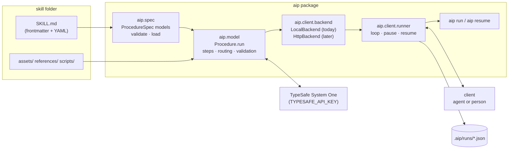

# Running a procedure

How `aip run` executes a skill, what talks to what, and what lands on disk.

## The pieces



- **`aip.spec`** parses `SKILL.md`, validates the frontmatter, the YAML against the format models, and the graph, then builds the runtime `Procedure`.
- **`aip.model`** is the engine. `Procedure.run(after, payload, history, thresholds)` is the whole server operation: resolve routers on the client's input, validate it against the receiving step's `inputs`, run the step, append a history entry, describe what comes next.
- **`aip.client.backend`** is the seam between runner and engine. `LocalBackend` calls `Procedure.run` in-process. An HTTP backend will post the same arguments to the AIP server. The runner is written against the interface, so it does not change when the server arrives.
- **`aip.client.runner`** is the client. It follows the engine's suggested input from step to step and stops when a decision belongs to the client.

## The step protocol

Every call, local or over HTTP, has the same shape.

Request:

| field        | meaning                                                                 |
|--------------|-------------------------------------------------------------------------|
| `after`      | the step the client just completed; `null` to start                      |
| `payload`    | the client's input for whatever comes next                              |
| `history`    | everything so far; the server appends, the client carries it            |
| `thresholds` | optional per-question overrides for this call                           |

Response:

| field       | meaning                                                                                      |
|-------------|----------------------------------------------------------------------------------------------|
| `ran`       | the step that ran (routers are walked on the way and recorded in history, never "ran")      |
| `kind`      | `decision`, `execution`, `client_task`, or `end`                                             |
| `result`    | the step's raw output                                                                        |
| `suggested` | the server's proposed input for the next step; the client may post it as-is or override it   |
| `review`    | decision answers under their threshold, with the distribution; empty means safe to pass through |
| `next`      | what receives the next input: a step with its `inputs`, or a router expanded into branches   |
| `history`   | the carried-in history plus this step's `{step, kind, input, result}` entry                  |

The server is stateless. State lives in the request and response, and the client carries it.

## The runner loop

```
payload = start input
after   = null
loop:
    node = what receives payload after `after`   (routers resolved on payload)
    if node is a decision and no decision model is available:
        PAUSE decision                             -> client answers the questions
    response = run(after, payload, history, thresholds)
    if response.next is null:                      DONE, print final state
    if response.kind == client_task:               PAUSE client_task -> client produces next input
    if response.review is non-empty:               PAUSE review      -> client confirms or overrides
    after, payload, history = response.ran, response.suggested, response.history
```

A pause writes the run file, prints a JSON block, and exits with code **3**. `aip resume <run-file> --input answer.json` merges the answer over `suggested` and re-enters the loop at `after`. With `--interactive`, a pause becomes terminal prompts instead and nothing is written.

| exit code | meaning                                    |
|-----------|--------------------------------------------|
| 0         | done; final state printed as JSON          |
| 1         | error (invalid skill, bad input, script failure) |
| 3         | paused; run file written, resume command printed |

### Pause kinds

| `paused`      | when                                               | what the client posts on resume                                   |
|---------------|----------------------------------------------------|-------------------------------------------------------------------|
| `decision`    | `TYPESAFE_API_KEY` is unset and a decision is next | one collapsed answer per question: `true`/`false`, a label, or a level |
| `review`      | a decision answered below its threshold            | any keys to override in `suggested`; usually the flagged question |
| `client_task` | the step handed work to the client                 | the keys in `expects` (the next step's `inputs`); extra keys pass through |

With a key set, decisions run against the model and only low-confidence answers pause. Without one, the client answers every decision itself, and history records those entries with `"manual": true`.

## Files

`aip run` writes exactly one file, and only on a pause: the run file, at `.aip/runs/<skill>-<timestamp>.json` unless `--run-file` says otherwise. It holds everything needed to continue:

```json
{
  "skill_dir": "examples/billing-support",
  "after": null,
  "suggested": { "message": "I was charged twice!" },
  "history": [],
  "pause": {
    "kind": "decision",
    "step": "triage",
    "questions": { "billing": { "type": "noul", "instructions": "..." },
                   "tone":    { "type": "choice", "instructions": "...", "criteria": { "angry": "...", "calm": "..." } } },
    "expects": { "message": "string" }
  },
  "thresholds": {},
  "created": 1790293854.39,
  "server": null,
  "name": null,
  "revision": null,
  "run_id": null
}
```

The last four are set when the run is on a server (below): the URL, the exact `name` and `revision` the run is pinned to, and the server's `run_id` once a step has run. `aip resume` rebuilds the right backend from them, so a run file is self-contained either way.

`.aip/` is gitignored. Nothing else is written: the skill folder is read-only to the runner, state travels in memory and in the run file, and scripts write only what they choose to.

## Worked example: `examples/billing-support`

The graph: `triage` (decision: is it billing, what is the tone) → `by-tone` (router) → `escalate` (script opens a ticket) or `reply` (client drafts a reply against the policy) → `end`.

### Without a decision model

```bash
$ echo '{"message": "I was charged twice!"}' > start.json
$ aip run examples/billing-support --input start.json --run-file run.json
{
  "paused": "decision",
  "step": "triage",
  "questions": {
    "billing": { "type": "noul",
                 "instructions": "Is this message about a charge, invoice, refund, or subscription payment?" },
    "tone":    { "type": "choice",
                 "instructions": "How upset is the customer? Angry means explicit frustration, threats to cancel, or demands.",
                 "criteria": { "angry": "Frustrated, demanding, or threatening to leave.",
                               "calm": "Neutral or polite, asking a question." } }
  },
  "expects": { "message": "string" },
  "suggested": { "message": "I was charged twice!" },
  "resume": "aip resume run.json --input <answer.json>",
  "run_file": "run.json"
}
$ echo $?
3
```

The client answers and resumes. The router sends `angry` to the script, which runs for real:

```bash
$ echo '{"billing": true, "tone": "angry"}' > answers.json
$ aip resume run.json --input answers.json
{
  "done": true,
  "state": { "message": "I was charged twice!", "billing": true, "tone": "angry",
             "ticket_id": 45067, "queue": "tier2" },
  "history": [
    { "step": "triage",   "kind": "decision",  "input": { "message": "..." },
      "result": { "answers": { "billing": { "type": "noul", "manual": true },
                               "tone":    { "type": "choice", "manual": "angry" } } },
      "manual": true },
    { "step": "by-tone",  "kind": "router",    "input": { "tone": "angry" }, "result": { "to": "escalate" } },
    { "step": "escalate", "kind": "execution", "input": { "..." : "..." },
      "result": { "message": "...", "ticket_id": 45067, "queue": "tier2" } },
    { "step": "end",      "kind": "end",       "input": { "..." : "..." }, "result": { "..." : "..." } }
  ]
}
$ echo $?
0
```

### With a decision model

Same start, `TYPESAFE_API_KEY` set. The model answers `billing` at 0.97 and `tone` as `angry` at 0.55 confidence, under the step's threshold of 0.6, so the run pauses for review instead of routing:

```json
{
  "paused": "review",
  "step": "triage",
  "review": [
    { "question": "tone", "type": "choice", "confidence": 0.55,
      "probabilities": { "angry": 0.55, "calm": 0.45 }, "reason": "confidence below 0.6" }
  ],
  "expects": { "message": "string", "tone": "string" },
  "suggested": { "message": "I was charged twice!", "billing": true, "tone": "angry" },
  "resume": "aip resume run.json --input <answer.json>",
  "run_file": "run.json"
}
```

The client reads the message, disagrees with the model, and overrides. The router now sends `calm` to the client task, which pauses again with the rendered template, the policy injected from `assets/policy.md`, and the reference the client may load on demand:

```bash
$ echo '{"tone": "calm"}' > override.json
$ aip resume run.json --input override.json
{
  "paused": "client_task",
  "step": "reply",
  "task": "...# Draft a reply\n\nWrite a short, calm reply to the customer below. Apply the policy exactly...\n\nCustomer message:\nI was charged twice!\n\nPolicy:\n# Refund policy\n\n- Duplicate charges are refunded in full within 5 business days.\n...",
  "references": [
    { "uri": "billing-support/references/help.md",
      "description": "Escalation contacts and plan matrix. Only for plan changes, currency issues, or charges older than 30 days." }
  ],
  "expects": { "message": "string" },
  "suggested": { "message": "I was charged twice!", "billing": true, "tone": "calm" },
  "resume": "aip resume run.json --input <answer.json>",
  "run_file": "run.json"
}
```

The client does the task and posts its output. `end` declares only `message`, so `reply` rides along as an extra key:

```bash
$ echo '{"reply": "Sorry about the duplicate charge. A full refund is on its way within 5 business days."}' > reply.json
$ aip resume run.json --input reply.json
{
  "done": true,
  "state": { "message": "I was charged twice!", "billing": true, "tone": "calm",
             "reply": "Sorry about the duplicate charge. A full refund is on its way within 5 business days." },
  "history": [ "triage", "by-tone", "reply", "end" ]
}
```

(History abbreviated; each entry carries the full `input` and `result` as in the first run, including the model's probabilities for `triage` and the client's override at `by-tone`.)

### Interactive

```bash
$ aip run examples/billing-support --interactive
message (string): I was charged twice!

tone: confidence below 0.6  (model says "angry")
  {"angry": 0.55, "calm": 0.45}
  keep "angry"? enter to keep, or a new value: calm

# Draft a reply
...
message (string) ["I was charged twice!"]:
{ "done": true, ... }
```

Same loop, same engine; prompts replace the run file.

## With a server

Nothing changes in the protocol. `aip server` exposes `Procedure.run` over HTTP for every published skill (`docs/server-design.md`), executes scripts with its own interpreter, holds the decision-model key, and records each run. The client points at it once:

```
$ export AIP_SERVER=http://localhost:8000            # or: aip config --server http://localhost:8000 [--token T]
$ aip publish examples/billing-support               # validate locally, upload, server validates again
billing-support@3f9c2a7d1e5b8c04
$ aip search "refund"                                # ranked by the server
billing-support@3f9c2a7d1e5b8c04  0.812  Triage an inbound billing message ...
$ aip info billing-support --example-input > start.json
$ aip run billing-support --input start.json         # same pause, same resume command
```

`aip run <name>` uses `HttpBackend`, which posts the same `after`, `payload`, `history`, and `thresholds` to `/procedures/<name>@<revision>/step` (and `/answer` for a manual decision) that `LocalBackend` passes to `Procedure.run`. The first call pins the name to one revision for the whole run. Pauses are identical; the run file additionally carries `server`, `name`, `revision`, and `run_id`, and `GET /runs/<run_id>` on the server shows the same history the client printed. A folder path (`aip run examples/billing-support`) still runs locally and never touches the server; `aip get <name>` downloads a published revision losslessly when you want the folder.
