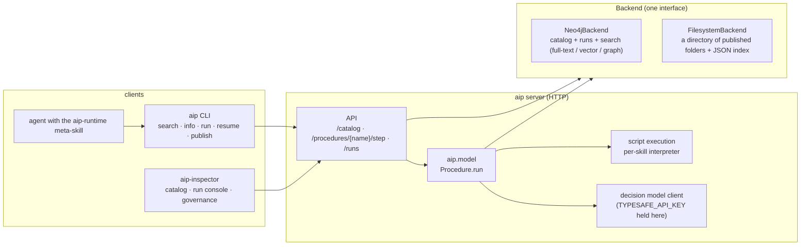

# AIP server design

Status: proposal for format 0.5a0, the client-server line. 0.4a0 is the last folder-only format. Companion to `running.md`, which
describes the step protocol and the local runner this design extends.

## 1. Goal

An agent should be able to use AIP with nothing but the `aip` client and one page of
directions: find a procedure, read its contract, run it, resume at pauses. Today the
client only works on skill folders it is handed, so discovery is done by the host
agent's skill system (a `SKILL.md` under `~/.claude/skills/`), not by AIP. This design
moves discovery and execution behind a server with one contract, lets the server pick
its storage and search backend, and names the inspector that governs it.

Principles, in order of priority:

1. **The client decides nothing.** `aip search`, `aip info`, `aip run`, `aip resume`
   are the same commands against any server. How search ranks, where files live, how
   decisions are answered, and which revision a name resolves to are server concerns.
2. **One contract, two backends.** The server exposes one HTTP API. Behind it, a
   backend interface with a Neo4j implementation (default; local or remote) and a
   filesystem implementation (a directory, nothing else). Both pass the same contract
   test suite.
3. **The server is the execution engine.** `Procedure.run` already is the whole
   server operation (`running.md`). Scripts run where the server runs; client tasks
   and manual decisions go to the client. State still travels in the request and
   response; the server stays stateless per call, with run persistence as a backend
   feature, not a protocol requirement.
4. **The inspector is a client.** `aip-inspector` uses the same API as the CLI. No
   endpoint exists for the UI that the CLI does not also have.
5. **Nothing already in the step protocol changes.** `after`, `payload`, `history`,
   `thresholds` in; `ran`, `kind`, `result`, `suggested`, `review`, `next`, `history`
   out. The catalog is added beside it.

## 2. Terminology

- **Procedure**: one AIP skill's graph, as today.
- **Skill**: the folder (SKILL.md plus scripts/assets/references/source). Published,
  it becomes a **revision**, identified `name@revision` where `revision` is the
  content hash the Neo4j projection already computes (`aip.db.neo4j._revision`).
- **Name**: `name` from the frontmatter. One name, many revisions. The server pins
  which revision `name` resolves to (default: newest published).
- **Catalog**: the set of published revisions and their metadata.
- **Run**: one traversal of a procedure, identified by a server-issued `run_id`,
  holding the same `history` the local runner carries today.
- **Backend**: the storage and search implementation behind the server.
- **Client**: the CLI, the inspector, or any program speaking the API.

## 3. Architecture



The existing `aip.client.backend.Backend` protocol (`describe`, `peek`, `run`,
`answer_decision`, `has_decision_model`) is the seam the runner already codes
against. `LocalBackend` stays for `aip run <folder>` with no server. A new
`HttpBackend` implements the same protocol by calling the API below, addressed by
name instead of folder. The runner does not change.

## 4. The client contract

### 4.1 CLI

| Command | Today | With a server |
|---|---|---|
| `aip search "<words>" [--limit N]` | — | ranked `name`, `revision`, `description`, score; ranking is the server's |
| `aip list` | `aip db list` (Neo4j only) | every name with its pinned revision and revision count |
| `aip info <name\|folder>` | folder only | by name: what `aip info <folder>` prints today, from the server |
| `aip run <name\|folder> --input start.json` | folder only | by name: starts a run on the server; pauses write a run file holding `run_id` |
| `aip resume <run-file> --input answer.json` | local | same; the run file carries the server URL and `run_id` |
| `aip publish <folder>` | — | validate locally, upload all files, server validates again, returns `name@revision` |
| `aip retire <name@revision>` | — | revision no longer resolvable by name (kept for runs that reference it) |
| `aip pin <name> <revision>` | — | which revision `name` resolves to |
| `aip config [--server URL] [--token T]` | — | where the client points; `AIP_SERVER` env var overrides; unset means local folders only |

Name resolution rules: `name` resolves to the pinned revision; `name@<revision>` is
exact; `name@latest` is the newest published regardless of pin. A folder path is
detected by the presence of `SKILL.md` and bypasses the server entirely, as today.

### 4.2 HTTP API

All bodies JSON. Errors are `{"error": {"kind": str, "message": str, "location"?: str}}`
with the validator's `kind` vocabulary reused where it applies.

Catalog:

| Method | Path | Body / query | Returns |
|---|---|---|---|
| `GET` | `/catalog/search?q=&limit=` | | `[{name, revision, description, score}]` |
| `GET` | `/catalog` | | `[{name, pinned, revisions: [{revision, published_at, retired}]}]` |
| `GET` | `/catalog/{name}` | optional `@revision` | the `describe()` document plus `aip info` fields (purpose, triggers, start input, steps) |
| `GET` | `/catalog/{name}/files` | optional `?archive=tar` | file manifest: path, size, sha256, mode; with `archive=tar`, a tar stream of every file plus the manifest |
| `GET` | `/catalog/{name}/files/{path}` | | the raw bytes of one file (the inspector's source view) |
| `POST` | `/catalog` | multipart or `{files: [{path, bytes_b64, mode}]}` | `{name, revision}`; 422 with validator issues on failure |
| `POST` | `/catalog/{name}/pin` | `{revision}` | |
| `POST` | `/catalog/{name}/retire` | `{revision}` | |

Execution, one endpoint per `Backend` method, addressed by name:

| Method | Path | Body | Returns |
|---|---|---|---|
| `POST` | `/procedures/{name}/peek` | `{after, payload}` | `describe_next(node)` |
| `POST` | `/procedures/{name}/step` | `{after, payload, history, thresholds?, run_id?}` | `StepResponse.to_dict()` plus `run_id` |
| `POST` | `/procedures/{name}/answer` | `{after, payload, history, answers, run_id?}` | same shape (manual decision) |
| `GET` | `/procedures/{name}/capabilities` | | `{decision_model: bool, executes_scripts: bool}` |

Runs (persistence; a backend may decline with 501, the CLI then keeps the run file
exactly as today):

| Method | Path | Returns |
|---|---|---|
| `POST` | `/runs` | `{run_id}` for `{name, revision}`; called by `step` implicitly when `run_id` is absent |
| `GET` | `/runs?name=&status=&limit=` | `[{run_id, name, revision, status, started_at, last_step}]` |
| `GET` | `/runs/{run_id}` | `{name, revision, status, history, pause?}` |

`status` is `running`, `paused`, `done`, or `error`. Every `step` and `answer` call
with a `run_id` appends to that run's history server-side; the client still receives
and may carry the full history, so a client that never persists works unchanged.

### 4.3 Runtime block

The runtime block that every skill carries verbatim says to run
`aip run <this skill's folder> --input <start.json>`. It gains one sentence: when a
server is configured, `aip run <name>` works the same and `aip search` finds
procedures. Because the block is validator-enforced verbatim, this is part of the
format bump to `0.5a0`; skills carrying the 0.4a0 text remain valid under a one-line
compatibility rule (the validator accepts the 0.4a0 text with a warning throughout
the 0.5a line).

## 5. The backend interface

One Python protocol in `aip.server.backend`, implemented twice. Search semantics are
deliberately unspecified beyond "ranked, deterministic for a fixed catalog"; the
contract tests check shape and a handful of obvious cases (exact name match ranks
first; a word only in one description finds that skill), not ranking quality.

```python
class CatalogBackend(Protocol):
    def publish(self, skill: SkillRecord) -> str:                       # returns revision
    def get(self, name: str, revision: str | None = None) -> SkillRecord
    def files(self, name: str, revision: str) -> list[FileRecord]
    def file(self, name: str, revision: str, path: str) -> bytes
    def list(self) -> list[NameSummary]
    def search(self, query: str, limit: int) -> list[SearchHit]         # backend decides how
    def pin(self, name: str, revision: str) -> None
    def retire(self, name: str, revision: str) -> None
    def resolve(self, ref: str) -> tuple[str, str]                      # "name" | "name@rev" | "name@latest"

class RunBackend(Protocol):                                             # optional
    def create(self, name: str, revision: str) -> str
    def append(self, run_id: str, entry: JSON, status: str, pause: JSON | None) -> None
    def get(self, run_id: str) -> RunRecord
    def list(self, name: str | None, status: str | None, limit: int) -> list[RunSummary]
```

`SkillRecord` is the existing `aip.db.neo4j` record (frontmatter, files with bytes
and hashes, parsed procedure); it moves to `aip.server.records` and both backends use
it. A backend may also expose `project(skill)` for analytics; the server never calls
it.

Materialisation: to execute a procedure the server needs the skill on disk. The
server keeps a cache directory, `<cache>/<name>@<revision>/<name>/`, rebuilt from
`files()` on first use and verified by hash (the `export` path that exists today).
`load_procedure` then runs unchanged against that folder. The filesystem backend
needs no cache: its published folder is already on disk and is used in place.

### 5.1 `Neo4jBackend` (default)

Local or remote: the `neo4j` Docker image or Neo4j Desktop on a laptop, a compose
sidecar next to a trial container, or Aura. The backend only needs a bolt URI.

- Reuses the lossless projection: `Skill {id: name@revision}`, `File`, `Procedure`,
  `Step`, `Input`, `Question` nodes and their edges. Adds `Name {name, pinned}`
  with `HAS_REVISION` edges, `retired` and `published_at` on `Skill`, and
  `Run {id, name, revision, status, started_at}` with `StepRun {order, step, kind,
  input, result, manual, review}` nodes linked `NEXT` in order and `OF_STEP` to the
  `Step` node they executed.
- `search`: a full-text index over `Skill.description`, `Procedure.purpose`, and
  the `trigger_when` list; optionally a vector index over the same text when an
  embedding provider is configured. Graph signals (which procedures declare an input
  with a given name, which end in a given output) are available to the inspector as
  Cypher, not to `search`.
- Governance queries the inspector will run are plain Cypher over this graph:
  decisions whose answers are most often overridden, procedures with no
  `do_not_use_when`, scripts that failed in the last N runs, routers that can
  reach the end without a decision.

### 5.2 `FilesystemBackend`

- A root directory and nothing else:

  ```
  <root>/
  ├── catalog.json                 names → {pinned, revisions: [{revision, published_at, retired}]}
  ├── skills/<name>/<revision>/    one revision
  │   ├── .aip-manifest.json       file manifest: path, size, sha256, mode
  │   └── <name>/                  the skill folder exactly as published (this is the materialised copy too;
  │                                the loader requires the folder to be named after the skill)
  └── runs/<run_id>.jsonl          one JSON line per history entry, first line is the run header
  ```

- `search` loads every pinned revision's description, purpose, and `trigger_when`
  into memory at startup (and on publish) and scores a query by weighted BM25 over
  Porter-stemmed terms (name field highest, then description, then purpose, then
  triggers; an exact name match wins outright). Pure Python, deterministic, no index
  files, adequate for catalogs of hundreds of procedures.
- Writes are atomic per file (write to a temp name, rename); `catalog.json` is the
  only file rewritten, under a lock.
- Zero external services; this is what a trial container or a laptop runs with no
  database. It is the backend the aip-skillbench harness installs per trial.

### 5.3 Contract tests

`tests/server/test_contract.py` parametrised over both backends (the filesystem
backend against a temp dir; Neo4j against `NEO4J_URI`, typically a local Docker
instance): publish the
`examples/billing-support` skill, resolve by every ref form, search finds it by a
word from its description, files round-trip byte for byte, pin and retire behave,
runs persist and list, and a full traversal through the HTTP layer reproduces the
`running.md` worked example. The Neo4j variant is skipped without `NEO4J_URI`.

## 6. Execution locality (decided)

Scripts run on the server, with the server's interpreter for that skill. Reasons:
`running.md` already plans a per-skill interpreter built from the skill's
environment file; decisions, routing, and script execution are then recorded in one
place, which is what makes runs auditable; and the client stays thin.

Consequences:

- Any file a script reads through the state (a `lightcurve_path`, an `stl_path`)
  must be reachable from the server. The supported pattern is co-location: the
  server runs on the machine, container, or volume that holds the data. For the
  aip-skillbench harness that means `aip server --backend filesystem` inside the
  trial container, listening on localhost, with the task's packages visible to the
  interpreter; `--backend neo4j` with a compose sidecar is the heavier alternative
  when the run graph itself is under study.
- Client tasks and manual decision answers remain client-side; nothing changes.
- Remote data is out of scope for this version. A later `assets` mechanism may let
  a client upload inputs with the start request.
- Scripts are untrusted code the server executes. The server runs them as a
  subprocess with a timeout (the step's `timeout`) under whatever isolation the
  deployment provides (container, user, seccomp); the server itself does not
  sandbox. Document this in the server's README in plain words.

## 7. Decision model

`TYPESAFE_API_KEY` is held by the server. `capabilities.decision_model` tells the
client whether decisions will be answered server-side; when false the client answers
them, as the runner does today. Per-question threshold overrides may be stored
server-side per `name` (`POST /catalog/{name}/thresholds`), which the inspector
exposes; a request's `thresholds` still wins for that call.

## 8. Client changes

- `aip.client.backend.HttpBackend(server_url, token, name)`: the five `Backend`
  methods over the endpoints in §4.2; `run` and `answer_decision` carry `run_id`.
- `RunFile` gains `server`, `name`, `revision`, `run_id`; `resume` reconstructs the
  right backend from it.
- `aip search`, `aip list`, `aip publish`, `aip retire`, `aip pin`, `aip config`.
- `aip run` and `aip info` accept a name when a server is configured. A folder still
  bypasses the server.
- `aip get <name>[@revision] [--out dir]` downloads a revision losslessly: fetch
  `/files?archive=tar`, unpack under `<out>/<name>/`, restore modes, hash every file
  against the manifest and abort naming the first mismatch, then run the validator.
  `source/` is included; it is part of the skill and of the revision hash.
  `aip get` followed by `aip publish` must yield the same revision; that is a
  contract test.

## 9. The `aip-runtime` meta-skill

A plain Agent Skill, not an AIP procedure, shipped in the package
(`aip runtime --skill` writes it; also under `skills/aip-runtime/` in the repo) and
versioned with the format. It is the "one page of directions":

- When the task might match a known procedure, run `aip search "<task words>"`
  first. Read the hits' descriptions; pick one or none.
- `aip info <name>` for the start input and an example `start.json`.
- `aip run <name> --input start.json`; on exit code 3 read the pause: `decision`
  means answer the listed questions; `review` means confirm or override the flagged
  answers; `client_task` means do the task and return the keys in `expects`. Put the
  answer in a JSON file and run the printed `resume` command. Repeat until
  `"done": true`; `state` is the result.
- Do not execute a procedure's steps by hand when the server can run it.
- Trust boundaries: the procedure's scripts run on the server; paths in the start
  input must be reachable there.

Under 120 lines, frontmatter `name: aip-runtime`, a `description` that triggers on
"procedure", "runbook", "workflow", and the `aip` command. It replaces, for the
server case, the per-skill runtime block as the thing the agent reads first.

## 10. `aip-inspector`

A web client of the API in §4.2, no private endpoints. Lives in its own repo
(`aip-inspector`); `aip-web` stays the project site. Served by `aip server
--inspector` from a built bundle in the package, or standalone against any server
URL.

Views, in build order:

1. **Catalog**: `GET /catalog` and `/catalog/search` as a searchable table; a
   procedure page from `/catalog/{name}` with purpose, triggers, do-not-use-when,
   start input, and the step graph drawn as a graph (nodes by kind, `inputs_to` and
   router branches as edges, the end step marked). Revisions and the pin.
2. **Source**: the file manifest and viewer from `/files`; diff between revisions.
3. **Run console**: choose a procedure, fill the start input from the example JSON,
   step. Each step shows the state before and after, a decision's questions with
   their full distributions and which crossed the threshold, the router's branch, a
   script's stdin and stdout, a client task's rendered template with the references
   it may load. Pauses are answered in the UI; the same `/step` and `/answer` calls
   the CLI makes.
4. **History**: `GET /runs` filtered by name and status; a run page replaying its
   history as a trace over the graph.
5. **Governance**: pin and retire; per-question threshold overrides; corpus
   questions answered by the backend (§5.1), shown as lists: decisions most
   overridden by clients, scripts failing most, procedures missing fields, routers
   with unreachable branches in practice (never taken in N runs).

Non-goals for the first version: editing procedures in the browser (authoring stays
with the aip skill), user accounts beyond a shared token, multi-server views.

## 11. Security

- One bearer token per server, two scopes: `read` (search, info, files, runs, step)
  and `publish` (publish, pin, retire, thresholds). Localhost with no token is
  allowed for the in-container and laptop cases.
- Scripts execute with the server's privileges; see §6. The server README states
  that publishing is equivalent to code execution on the server.
- The inspector never stores the token beyond the session.

## 12. Phases

1. **Records and backend interface** (`aip.server.records`, `aip.server.backend`),
   the filesystem backend, contract tests. `aip db` keeps working, re-pointed at the
   Neo4j backend.
2. **HTTP server** (`aip server --backend filesystem|neo4j`), catalog and execution
   endpoints, materialisation cache. `HttpBackend` in the client; `aip search`,
   `list`, `info <name>`, `run <name>`, `resume`, `publish`, `config`. Runtime
   block sentence and format bump to `0.5a0`. The `aip-runtime` meta-skill.
3. **Neo4j backend** on the existing projection plus names and runs; full-text
   search; the governance queries as named Cypher in the package.
4. **Runs API and inspector** views 1 to 4.
5. **Governance** (pins, retire, thresholds, corpus queries) and inspector view 5.

Acceptance for phase 2, which is what aip-skillbench needs: in a fresh container
with the filesystem backend, `aip publish <pack>` then an agent holding only the
`aip-runtime` skill and the server URL completes a task through `search`, `info`,
`run`, and `resume`, with the run visible in `GET /runs`.

## 13. What changes downstream

In aip-skillbench, mode 4 (`aip-runtime`) becomes: start `aip server --backend
filesystem` in the trial container, `aip publish` the task's pack, mount only the
`aip-runtime` meta-skill, write the memory pointing at the server. Nothing
task-specific is mounted under `~/.claude/skills/`. Mode 3 keeps mounting the pack
artifact. The harness's four-modes plan (`prompts/four-modes-plan.md` there) is
revised once phase 2 lands.

## 14. Open questions

- Should `search` accept structured hints (`--input-name lightcurve_path`) that a
  graph backend can use? Proposed: not in the first version; the inspector can show
  that query, and the CLI can grow a flag later without changing the contract.
- Revision pinning per client (a run file pins its revision) versus per server:
  both; the run file always records the exact revision it started on.
- Whether to let the server run a procedure's client tasks against a configured
  model, making the server a full agent for headless use. Out of scope; it changes
  the client's role.
